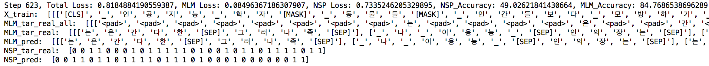

# BERT: Pre-training of Deep Bidirectional Transformers for Language Understanding
Simple implementation of BERT (TensorFlow 2.0 style) https://arxiv.org/abs/1810.04805



### ToDo
- Beam search
- Label Smoothing
- Multiprocessing (for preprocessing NSP data in parallel)  

### Requirements
```
pip install sentencePiece
```

### Future Work
- GPT2

### Reference Repositories
- [TF 2.0 Style Transformer](https://colab.research.google.com/github/tensorflow/docs/blob/master/site/en/r2/tutorials/text/transformer.ipynb)
- [The Annotated Transformer](http://nlp.seas.harvard.edu/2018/04/03/attention.html)
- [Sentencepiece](https://colab.research.google.com/drive/1rQ0tgXmHv02sMO6VdTO0yYaTvc1Yv1yP)
- [Sentencepiece2](https://lovit.github.io/nlp/2018/04/02/wpm/)
- [Official BERT](https://github.com/google-research/bert/blob/master/modeling.py)
- [PyTorch_BERT_Implementation](https://github.com/codertimo/BERT-pytorch)